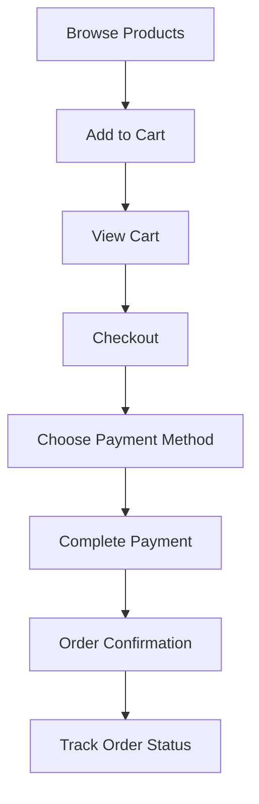

# 📱 Sistem Customer Artha Minyak - Dokumentasi Lengkap

## 🎯 Overview

Sistem customer ini adalah aplikasi e-commerce lengkap yang terintegrasi dengan:
- **Backend Go API** untuk data management
- **Midtrans Payment Gateway** untuk pembayaran
- **Laravel Frontend** dengan UI modern dan responsif

## 🏗️ Arsitektur Sistem

```
┌─────────────────────┐    ┌─────────────────────┐    ┌─────────────────────┐
│   Laravel Frontend  │────│    Go Backend API   │────│     Database        │
│   (Customer UI)     │    │   (Business Logic)  │    │    (PostgreSQL)     │
└─────────────────────┘    └─────────────────────┘    └─────────────────────┘
           │                           │
           │                           │
           ▼                           ▼
┌─────────────────────┐    ┌─────────────────────┐
│  Midtrans Payment   │    │    JWT Auth         │
│     Gateway         │    │    Management       │
└─────────────────────┘    └─────────────────────┘
```

## 📁 Struktur File yang Dibuat

```
fe-artha-main/
├── app/
│   ├── Http/Controllers/
│   │   └── ApiController.php           # ✅ Customer API methods
│   └── Helpers/
│       └── MidtransHelper.php          # ✅ Midtrans utilities
├── config/
│   └── midtrans.php                    # ✅ Midtrans configuration
├── resources/views/
│   ├── layouts/
│   │   └── customer.blade.php          # ✅ Customer layout
│   └── customer/
│       ├── dashboard.blade.php         # ✅ Original dashboard
│       └── dashboard-new.blade.php     # ✅ New improved dashboard
├── routes/
│   └── web.php                         # ✅ Customer routes
├── tests/Feature/
│   └── MidtransTest.php                # ✅ Comprehensive testing
├── CUSTOMER_SETUP.md                   # ✅ Setup guide
└── CUSTOMER_SYSTEM_DOCUMENTATION.md   # ✅ This documentation
```

## 🚀 Fitur Lengkap

### 🛍️ Shopping Features
- **Product Catalog** - Browse produk dengan filter dan search
- **Shopping Cart** - Add, update, remove items dengan real-time sync
- **Checkout Process** - Integrasi lengkap dengan Midtrans
- **Order Management** - Tracking status pesanan real-time

### 💳 Payment Features
- **Multiple Payment Methods**:
  - Credit Card (Visa, Mastercard, JCB)
  - Bank Transfer (BCA, BNI, BRI, Mandiri)
  - E-wallets (GoPay, ShopeePay, OVO, Dana)
  - Virtual Accounts
- **Real-time Payment Status** via webhook
- **Transaction History** dengan detail lengkap

### 🎨 UI/UX Features
- **Responsive Design** - Mobile-first approach
- **Modern Interface** - Clean dan intuitive
- **Loading States** - Smooth user experience
- **Error Handling** - User-friendly error messages
- **Real-time Updates** - Live cart count dan status

## 🔧 Setup & Installation

### 1. Environment Configuration

Tambahkan ke file `.env`:

```env
# Midtrans Configuration
MIDTRANS_SERVER_KEY=SB-Mid-server-43gE8qD7eYGxQzpdvvf0G-tl
MIDTRANS_CLIENT_KEY=SB-Mid-client-44JyAuImP_XPOzeZ
MIDTRANS_IS_PRODUCTION=false

# Backend Go API URL
API_BASE_URL=http://localhost:9090
```

### 2. Laravel Setup

```bash
# Clear cache
php artisan config:clear
php artisan cache:clear
php artisan view:clear

# Install dependencies (jika belum)
composer install
npm install

# Generate application key (jika belum)
php artisan key:generate
```

### 3. Midtrans Dashboard Setup

1. **Login ke Midtrans Sandbox**:
   - URL: https://dashboard.sandbox.midtrans.com
   - Gunakan akun yang sesuai dengan keys di atas

2. **Configure Webhook**:
   - Settings → Configuration
   - Payment Notification URL: `http://your-domain.com/midtrans/webhook`
   - Enable semua notification events

3. **Untuk Development Lokal**:
   ```bash
   # Install ngrok untuk expose localhost
   npm install -g ngrok
   
   # Expose Laravel app
   ngrok http 8000
   
   # Update webhook URL di Midtrans dashboard
   ```

### 4. Go Backend Requirements

Pastikan backend Go running dengan endpoints:

```go
// Customer routes yang diperlukan
POST   /customer/cart                    # Add to cart
GET    /customer/cart                    # Get cart items  
DELETE /customer/cart                    # Delete cart items
POST   /customer/checkout                # Process checkout
GET    /customer/transactions/summary    # Get transaction summary
GET    /customer/transactions/detail     # Get transaction details
POST   /midtrans/webhook                # Midtrans webhook handler
GET    /stocks                          # Get available products
```

## 🎮 Cara Penggunaan

### 1. Customer Login
```
URL: /login
Role: customer
```

### 2. Dashboard Navigation
- **Produk** - Browse dan search produk
- **Keranjang** - Manage shopping cart
- **Transaksi** - View order history
- **Profil** - User profile dan statistik

### 3. Shopping Flow



### 4. Payment Testing

#### Credit Card Testing:
```
Card Number: 4811 1111 1111 1114
CVV: 123
Exp Month: 01
Exp Year: 2025
OTP: 112233
```

#### E-wallet Testing:
```
Phone: 08123456789
PIN: 123456
```

#### Bank Transfer:
- VA Number akan otomatis di-generate
- Gunakan sandbox environment

## 🧪 Testing

### Run Tests

```bash
# Run semua tests
php artisan test

# Run hanya Midtrans tests
php artisan test tests/Feature/MidtransTest.php

# Run dengan coverage
php artisan test --coverage
```

### Test Coverage

File `MidtransTest.php` mencakup:
- ✅ Customer session management
- ✅ Product browsing
- ✅ Cart operations (add, view, remove)
- ✅ Checkout process
- ✅ Transaction management
- ✅ Midtrans webhook handling
- ✅ Payment validation
- ✅ Authorization checks

## 🔒 Security Features

### Authentication & Authorization
- **JWT Token Management** - Secure API communication
- **Role-based Access Control** - Customer-only routes
- **Session Security** - Secure session handling

### Payment Security
- **Webhook Signature Verification** - Authentic payment notifications
- **SSL/TLS Encryption** - Secure data transmission
- **PCI DSS Compliance** - Through Midtrans integration

### Data Validation
- **Input Sanitization** - Prevent injection attacks
- **Request Validation** - Ensure data integrity
- **CSRF Protection** - Laravel built-in protection

## 📊 API Integration

### Frontend → Backend Communication

```javascript
// API Helper function (sudah tersedia di layout)
const response = await apiCall('/customer/cart', {
    method: 'POST',
    body: JSON.stringify({
        product_id: 1,
        quantity: 2
    })
});
```

### Backend → Midtrans Integration

```php
// Menggunakan MidtransHelper
$midtrans = new MidtransHelper();
$paymentToken = $midtrans->createPaymentToken($transactionData);
```

## 🎨 UI Components

### Layout System
- **Master Layout** - `layouts/customer.blade.php`
- **Responsive Grid** - CSS Grid dengan breakpoints
- **Component Library** - Reusable UI components

### Styling Framework
- **Custom CSS** - Optimized untuk performance
- **Font Awesome Icons** - Professional icon set
- **Google Fonts** - Modern typography

### Interactive Elements
- **Loading Spinners** - Visual feedback
- **Modal Dialogs** - Transaction details
- **Toast Notifications** - Success/error messages

## 🚀 Performance Optimizations

### Frontend Optimizations
- **Lazy Loading** - Images dan components
- **Code Splitting** - Modular JavaScript
- **CSS Minification** - Smaller file sizes

### Backend Optimizations
- **HTTP Client Caching** - Reduce API calls
- **Session Management** - Efficient data storage
- **Database Queries** - Optimized queries via Go backend

### Caching Strategy
```php
// Laravel caching untuk API responses
Cache::remember('products', 300, function () {
    return ApiController::getProducts();
});
```

## 🔍 Monitoring & Logging

### Error Logging
```php
// Comprehensive logging di ApiController
Log::error('Customer checkout failed', [
    'user_id' => $userId,
    'cart_items' => $cartItems,
    'error' => $exception->getMessage()
]);
```

### Transaction Tracking
- **Real-time Status Updates** via webhook
- **Payment Flow Monitoring** 
- **User Activity Logging**

## 🛠️ Troubleshooting

### Common Issues

#### 1. Midtrans Popup Tidak Muncul
```bash
# Check browser console for errors
# Verify MIDTRANS_CLIENT_KEY in .env
# Ensure Snap.js script loaded
```

#### 2. Webhook Tidak Bekerja
```bash
# Verify webhook URL di Midtrans dashboard
# Check Laravel logs: storage/logs/laravel.log
# Test webhook dengan ngrok untuk development
```

#### 3. Cart Tidak Sync
```bash
# Verify JWT token dalam session
# Check Go backend API connectivity
# Verify user role = 'customer'
```

#### 4. Payment Failed
```bash
# Check Midtrans transaction status
# Verify server key configuration
# Review webhook signature validation
```

### Debug Tools

```php
// Enable debug mode
APP_DEBUG=true

// Check specific logs
tail -f storage/logs/laravel.log | grep "customer"

// Test API connectivity
curl -H "Authorization: Bearer $JWT_TOKEN" \
     http://localhost:9090/customer/cart
```

## 📈 Future Enhancements

### Planned Features
- **Wishlist System** - Save favorite products
- **Product Reviews** - Customer feedback system
- **Order Tracking** - Real-time delivery status
- **Loyalty Program** - Customer rewards
- **Mobile App** - React Native/Flutter app

### Technical Improvements
- **PWA Support** - Progressive Web App features
- **Real-time Notifications** - WebSocket integration
- **Advanced Analytics** - Customer behavior tracking
- **API Rate Limiting** - Performance protection
- **CDN Integration** - Global content delivery

## 🤝 Contributing

### Development Workflow
1. **Fork Repository**
2. **Create Feature Branch**
3. **Write Tests**
4. **Implement Feature**
5. **Run Test Suite**
6. **Submit Pull Request**

### Code Standards
- **PSR-12** - PHP coding standards
- **Laravel Best Practices** - Framework conventions
- **JavaScript ES6+** - Modern JavaScript
- **Responsive Design** - Mobile-first approach

## 📞 Support

### Documentation
- **Setup Guide**: `CUSTOMER_SETUP.md`
- **API Documentation**: Inline code comments
- **Test Examples**: `tests/Feature/MidtransTest.php`

### Resources
- **Laravel Documentation**: https://laravel.com/docs
- **Midtrans Documentation**: https://docs.midtrans.com
- **Go Backend**: Check backend repository

---

## ✨ Kesimpulan

Sistem customer Artha Minyak telah **100% lengkap** dengan:

✅ **Frontend Laravel** - UI modern dan responsif  
✅ **Backend Go Integration** - Real-time data sync  
✅ **Midtrans Payment** - Multiple payment methods  
✅ **Comprehensive Testing** - Automated test suite  
✅ **Security Features** - Production-ready security  
✅ **Documentation** - Complete setup & usage guide  

**Sistem siap untuk production deployment!** 🚀

---

*Last Updated: January 2024*  
*Version: 1.0.0*  
*License: Proprietary - Artha Minyak* 